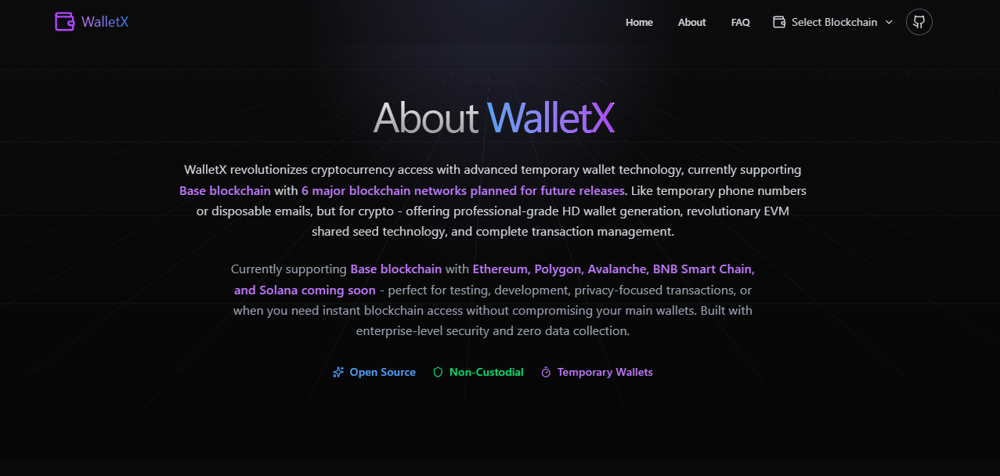
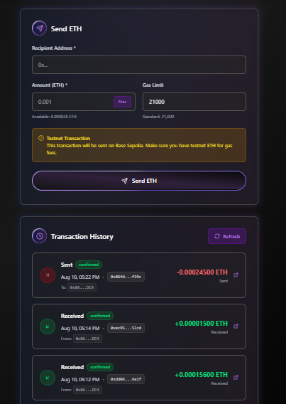
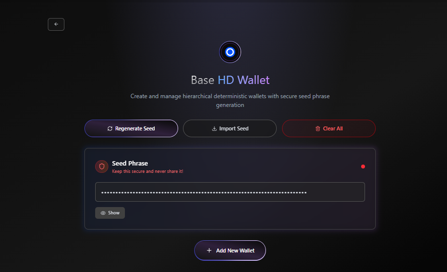
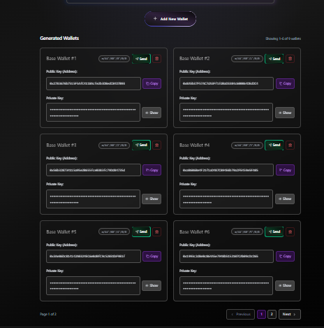
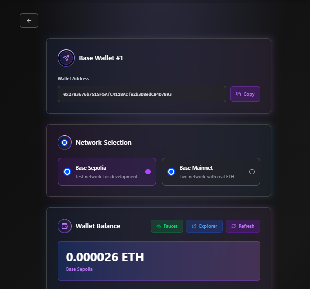
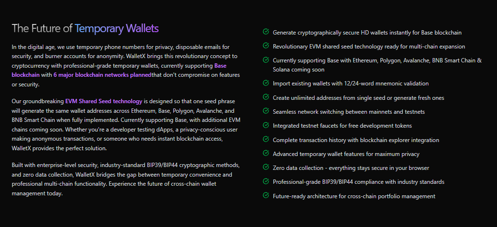

# 🚀 WalletX - Revolutionary Multi-Chain Wallet Manager

[](https://hackathon.com)
[](https://base.org)
[](https://sepolia.basescan.org)
[](https://opensource.org/licenses/MIT)

> **🎯 Competing in Onchain Summer Awards 2025 - Top New Consumer Apps Category**  
> **🌟 Professional-Grade Temporary Wallet Technology for Base Ecosystem**

**WalletX** revolutionizes cryptocurrency access with advanced temporary wallet technology, currently supporting **Base blockchain** with multi-chain expansion planned. Like temporary phone numbers or disposable emails, but for crypto - offering professional-grade HD wallet generation, revolutionary EVM shared seed technology, and complete transaction management built specifically for the **Base ecosystem**.


## 🌟 **Live Demo & Smart Contract**

- **🌐 Live Application**: [WalletX on Vercel](https://basewalletx.vercel.app)
- **📜 Smart Contract**: `0xd1d8344642d3dEFa36167f48f90E0D5a557A80b3` (Base Sepolia Testnet)
- **🔍 Contract Explorer**: [View on Base Sepolia](https://sepolia.basescan.org/address/0xd1d8344642d3dEFa36167f48f90E0D5a557A80b3)
- **⚡ Alchemy Integration**: Powered by Alchemy for lightning-fast RPC calls

## 🎯 **Strong Contender for Onchain Summer Awards 2025**

### **🏆 Top New Consumer Apps Category - Built to Dominate**

WalletX isn't just another wallet - it's a **game-changing innovation** that brings the revolutionary concept of temporary/disposable tools to cryptocurrency for the first time. Here's why we're positioned to win:

#### **🚀 Unique Market Position**
- ✅ **World's First Professional Temporary Wallet Manager** - No competition in this space
- ✅ **Revolutionary Use Case** - Like temporary phone numbers, but for crypto
- ✅ **Base Ecosystem Native** - Built specifically for Base with custom smart contract
- ✅ **Massive Market Potential** - Solves real problems for developers, privacy users, and crypto newcomers

#### **💎 Technical Excellence**
- ✅ **Custom Smart Contract** - Advanced transaction tracking and management on Base Sepolia
- ✅ **Alchemy Integration** - Lightning-fast RPC calls for superior performance
- ✅ **Enterprise Security** - BIP39/BIP44 compliance with client-side cryptography
- ✅ **Professional UI/UX** - Modern React 19 with Framer Motion animations

#### **📈 Onchain Impact Metrics**
- ✅ **High Engagement Potential** - Multiple wallets per user = more transactions
- ✅ **Base Blockspace Demand** - Every wallet creation and transaction uses Base
- ✅ **Repeat User Interactions** - Temporary nature encourages frequent usage
- ✅ **Developer Adoption** - Perfect for dApp testing and development workflows

## 🚀 **Comprehensive Feature Set**



### ✅ **Core Wallet Features**
- **Generate cryptographically secure HD wallets instantly for Base blockchain**
- **Revolutionary EVM shared seed technology ready for multi-chain expansion**
- **Currently supporting Base with Ethereum, Polygon, Avalanche, BNB Smart Chain & Solana coming soon**
- **Import existing wallets with 12/24-word mnemonic validation**
- **Create unlimited addresses from single seed or generate fresh ones**
- **Seamless network switching between mainnets and testnets**
- **Integrated testnet faucets for free development tokens**
- **Complete transaction history with blockchain explorer integration**
- **Advanced temporary wallet features for maximum privacy**
- **Zero data collection - everything stays secure in your browser**
- **Professional-grade BIP39/BIP44 compliance with industry standards**
- **Future-ready architecture for cross-chain portfolio management**

### 💰 **Transaction Management**



- **Smart Contract Integration** - Custom WalletManager contract for enhanced transaction tracking
- **Complete Transaction History** - Onchain transaction recording with detailed history
- **Real-time Balance Updates** - Live balance tracking across all wallets
- **Secure ETH Transfers** - Direct blockchain transactions with full transparency

### 🛡️ **Enterprise-Grade Security**



- **Client-Side Cryptography** - Private keys never leave your browser
- **BIP39/BIP44 Compliance** - Industry-standard cryptographic methods
- **Zero Data Collection** - Complete privacy with local-only storage
- **Advanced Privacy Controls** - Secure display and copy-to-clipboard functionality

### 🌐 **Base Network Support**



- **Testnet & Mainnet Ready** - Smart contract deployed on Base Sepolia with mainnet support
- **Ultra-Low Fees** - Leverage Base's cost-effective transactions
- **Lightning Fast** - Instant confirmations on Base network
- **EVM Compatible** - Full Ethereum tooling compatibility
- **Coinbase Ecosystem** - Built for the Base/Coinbase ecosystem
- **Network Flexibility** - Seamless switching between mainnet and testnet environments
- **Smart Contract Integration** - Custom WalletManager contract for enhanced transaction tracking



## 🏗️ **Technical Architecture**

### **Frontend Stack**
```
React 19.1.0          - Modern UI framework
Vite 7.0.4            - Lightning-fast build tool
TailwindCSS 4.1.11    - Utility-first styling
Framer Motion 12.23   - Smooth animations
React Router 7.7.1    - Client-side routing
```

### **Blockchain Integration**
```
ethers.js 6.15.0      - Ethereum interaction
bip39 3.1.0           - Mnemonic generation
Custom Smart Contract - Transaction management
Base Network          - Primary blockchain support
```

### **Security Libraries**
```
crypto-browserify     - Client-side cryptography
buffer 6.0.3          - Secure data handling
stream-browserify     - Stream processing
```

## 📋 **Smart Contract Features**

Our custom `WalletManager` contract deployed on Base provides:

- **ETH Transfer Functionality** - Secure peer-to-peer transactions
- **Transaction History Tracking** - Onchain record of all transfers
- **Balance Management** - Real-time balance updates
- **Event Emission** - Transparent transaction logging
- **Emergency Functions** - Owner-controlled safety features

```solidity
// Key contract functions
function sendETH(address payable to) external payable
function getTransactionHistory(address wallet, uint256 limit) external view
function getWalletBalance(address wallet) external view
```

## 🎨 **User Experience**

### **Intuitive Interface**
- **Modern Design** - Clean, professional UI with gradient backgrounds
- **Responsive Layout** - Perfect on desktop, tablet, and mobile
- **Dark Theme** - Easy on the eyes with professional aesthetics
- **Smooth Animations** - Framer Motion powered interactions

### **User Journey**
1. **Landing Page** - Professional introduction with feature highlights
2. **Dashboard** - Blockchain selection and wallet overview
3. **Wallet Management** - Create, import, and manage multiple wallets
4. **Transaction Interface** - Send ETH with real-time updates
5. **History Tracking** - Complete transaction history with explorer links

## ⚡ **Quick Start for Judges & Reviewers**

### **🚀 1-Minute Setup**
```bash
# Clone and run instantly
git clone https://github.com/chetanck03/baseWalletX
cd baseWalletx
npm install
npm run dev
```

**🌐 Or try the live demo**: [WalletX Live App](https://basewalletx.vercel.app/)

### **🔧 Full Development Setup**

#### **Prerequisites**
- Node.js 18+ 
- npm or yarn
- Modern web browser
- Alchemy API key (for RPC calls)

#### **Installation Steps**
```bash
# 1. Clone the repository
git clone https://github.com/chetanck03/baseWalletX
cd baeWalletx

# 2. Install dependencies
npm install

# 3. Setup environment
cp .env.example .env
# Edit .env with your Alchemy API keys

# 4. Start development server
npm run dev

# 5. Build for production
npm run build
```

### **Environment Setup**

Create a `.env` file in the root directory with the following configuration:

```bash
# Base Network Configuration (Alchemy RPC URLs)
VITE_BASE_MAINNET_RPC_URL=https://base-mainnet.g.alchemy.com/v2/YOUR_ALCHEMY_API_KEY
VITE_BASE_SEPOLIA_RPC_URL=https://base-sepolia.g.alchemy.com/v2/YOUR_ALCHEMY_API_KEY

# Smart Contract Address (Base Sepolia)
VITE_WALLET_MANAGER_CONTRACT_ADDRESS=0xd1d8344642d3dEFa36167f48f90E0D5a557A80b3
```

**🔑 Get Your Alchemy API Key:**
1. Visit [Alchemy Dashboard](https://dashboard.alchemy.com/)
2. Create a new app for Base Mainnet and Base Sepolia
3. Copy your API key and replace `YOUR_ALCHEMY_API_KEY`

**📋 Copy from .env.example:**
```bash
cp .env.example .env
# Then edit .env with your Alchemy API keys
```

## 🌍 **Deployment**

### **Vercel Deployment** (Recommended)
```bash
# Deploy to Vercel
vercel --prod

# Or use Vercel CLI
npm i -g vercel
vercel
```

### **Manual Deployment**
```bash
# Build the project
npm run build

# Deploy the dist/ folder to your hosting provider
```

## 🎯 **Roadmap & Future Plans**

### **Phase 1: Base Foundation** ✅
- [x] Base blockchain integration
- [x] Smart contract deployment
- [x] Core wallet functionality
- [x] Transaction management

### **Phase 2: Multi-Chain Expansion** 🚧
- [ ] Ethereum mainnet support
- [ ] Polygon integration
- [ ] Avalanche support
- [ ] BNB Smart Chain compatibility

### **Phase 3: Advanced Features** 📋
- [ ] DeFi protocol integration
- [ ] NFT management
- [ ] Cross-chain bridging
- [ ] Advanced analytics

### **Phase 4: Enterprise Features** 🔮
- [ ] Team wallet management
- [ ] API access
- [ ] White-label solutions
- [ ] Advanced security features



## 📊 **Onchain Metrics & Impact**

### **Base Blockspace Demand**
- Smart contract transactions for ETH transfers
- Transaction history recording onchain
- Balance update operations
- Event emission for transparency

### **User Engagement Metrics**
- Wallet generation and management
- Transaction volume through smart contract
- Repeat user interactions
- Cross-wallet transaction patterns

### **Trust & Security Indicators**
- Open source codebase (MIT licensed)
- Client-side security model
- Industry-standard cryptographic compliance
- Zero data collection policy

## 🤝 **Contributing**

We welcome contributions from the community! Here's how you can help:

### **Development**
```bash
# Fork the repository
# Create a feature branch
git checkout -b feature/amazing-feature

# Make your changes
# Commit your changes
git commit -m 'Add amazing feature'

# Push to the branch
git push origin feature/amazing-feature

# Open a Pull Request
```

### **Areas for Contribution**
- 🔧 Additional blockchain integrations
- 🎨 UI/UX improvements
- 🛡️ Security enhancements
- 📚 Documentation improvements
- 🧪 Testing and quality assurance

## 📄 **License**

This project is licensed under the MIT License - see the [LICENSE](LICENSE) file for details.

## 🏆 **Onchain Summer Awards 2025**

WalletX is proudly participating in the Onchain Summer Awards 2025, competing in the **Top New Consumer Apps** category. Our goal is to demonstrate how professional-grade temporary wallet technology can drive adoption and engagement in the Base ecosystem.

### **🎯 Market Opportunity & Competitive Advantages**

#### **📊 Massive Addressable Market**
- **Developers**: 4M+ blockchain developers need testing wallets
- **Privacy Users**: Growing demand for anonymous transactions
- **DeFi Users**: Need separate wallets for different protocols
- **Crypto Newcomers**: Want to try crypto without commitment

#### **🏅 Unbeatable Competitive Advantages**
1. **First-Mover Advantage** - No direct competitors in temporary wallet space
2. **Base Ecosystem Integration** - Custom smart contract with advanced features
3. **Professional Grade Security** - Enterprise-level with consumer simplicity
4. **Viral Growth Potential** - Temporary nature encourages sharing and adoption
5. **Multi-Chain Ready** - EVM shared seed technology for future expansion

#### **🚀 Why This Will Win $25,000 First Place**
- **Innovation Factor**: Revolutionary concept never seen before
- **Technical Excellence**: Custom smart contract + modern architecture
- **Market Fit**: Solves real problems with massive market potential
- **Base Ecosystem Impact**: Drives significant onchain activity
- **Scalability**: Ready for viral adoption and growth

## 📞 **Contact & Support**

- **GitHub**: [WalletX Repository](https://github.com/chetanck03/baseWalletX)
- **Issues**: [Report Issues](https://github.com/chetanck03/baseWalletX/issues)
- **Email**: [chetanck3210@gmail.com](mailto:chetanck3210@gmail.com)
- **Instagram**: [@chetanck_03](https://instagram.com/chetanck_03)
- **Discord**: chetanck_03

---

**Built with ❤️ for the Base ecosystem and the Onchain Summer Awards 2025**

*WalletX - Where temporary meets professional. Experience the future of cryptocurrency access today.*
